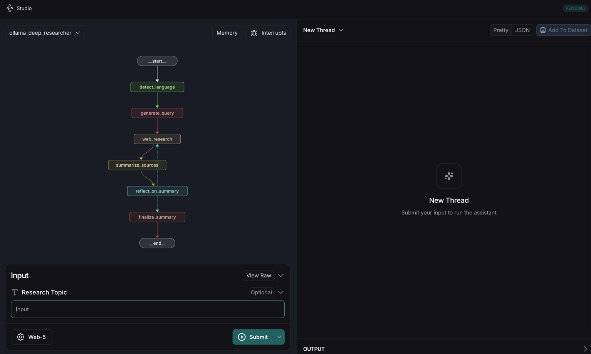

# Deep Research Assistant (static reflectionn count)
Данный репозиторий основан на https://github.com/langchain-ai/ollama-deep-researcher

Мультиязычный исследовательский ассистент на базе LangGraph и LangSmith SDK со структурированным выводом и итеративным интернет поиском за него отвечает [Сервис tavily](https://tavily.com/).



Short summary:
<video src="https://github.com/user-attachments/assets/f2d0dce1-933c-4633-840b-b6c7a2032c01" controls></video>


## Важно к прочтению! 
1) LLM Данная реализация работает c удаленным vLLM контуром https://github.com/vllm-project/vllm
2) Данна реализация использует [Сервис tavily](https://tavily.com/) после регистрации предоставляет 1000 реквестов беслпатно!
 
## Установка и настройка

 Установка LangGraph CLI
```bash
pip install -U "langgraph-cli[inmem]"
```
Установка проекта
```bash
pip install -e .
```

### 2. Конфигурация окружения
Создайте файл `.env`:
```env
# Search API Configuration
TAVILY_API_KEY=your_tavily_key_here

# LLM Configuration
LLM_API_KEY=your_api_key_here
LLM_API_BASE=https://your-vllm-server/v1
LOCAL_LLM=your_model_name
```

### 3. Запуск
Локальный запуск
```bash
langgraph dev
```

### 4. Доступ к интерфейсу
- Локально: https://smith.langchain.com/studio/?baseUrl=http://127.0.0.1:2024
- На сервере: https://smith.langchain.com/studio/?baseUrl=https://your-domain.com

## Схемы и процесс обработки
Все промпты можно найти в [prompts.py](src%2Fassistant%2Fprompts.py)

### Схемы запросов

#### 1. Определение языка
```python
{
    "type": "object",
    "properties": {
        "language": {"type": "string"},      # Название языка
        "language_code": {"type": "string"}  # ISO код языка
    }
}
```

#### 2. Поисковый запрос
```python
{
    "type": "object",
    "properties": {
        "query": {"type": "string"},     # Запрос
        "aspect": {"type": "string"},    # Аспект
        "rationale": {"type": "string"}  # Обоснование
    }
}
```

#### 3. Суммаризация
```python
{
    "type": "object",
    "properties": {
        "summary": {"type": "string"}  # Резюме
    }
}
```

#### 4. Рефлексия
```python
{
    "type": "object",
    "properties": {
        "knowledge_gap": {"type": "string"},    # Пробел в знаниях
        "follow_up_query": {"type": "string"}   # Следующий запрос
    }
}
```

### Параметры системы

```python
# LLM параметры
max_tokens = 2000        # Токены для LLM ответа
temperature = 0         # Креативность отключена

# Tavily параметры
search_depth = "advanced"  # Глубина поиска
max_results = 1           # Количество результатов
max_tokens = 8000         # Токены в результатах
tokens_per_source = 1000  # Токены на источник

# Цикл исследования
max_web_research_loops = 3  # Максимум итераций
```

## Процесс работы

```
1. START -> detect_language
   - Определение языка входного запроса
   - Сохранение языка в состоянии

2. detect_language -> generate_query
   - Генерация поискового запроса на определенном языке
   - Структурированный вывод с query/aspect/rationale

3. generate_query -> web_research
   - Поиск через Tavily API
   - Учет языка в параметрах поиска
   - Ограничение токенов и форматирование результатов

4. web_research -> summarize_sources
   - Суммаризация найденной информации
   - Сохранение контекста предыдущих итераций
   - Вывод на языке запроса

5. summarize_sources -> reflect_on_summary
   - Анализ пробелов в информации
   - Генерация следующего запроса
   - Проверка количества итераций

6. reflect_on_summary -> [web_research или finalize_summary]
   - Если iterations <= 3: новый цикл поиска
   - Иначе: финализация результатов

7. finalize_summary -> END
   - Форматирование итогового отчета
   - Добавление источников
```


## Структура проекта
```
.
├── src/
│   └── assistant/
│       ├── configuration.py   # Конфигурация
│       ├── graph.py          # Основной граф
│       ├── prompts.py        # Промпты
│       ├── state.py          # Состояние
│       └── utils.py          # Утилиты
├── .env                      # Переменные окружения
└── langgraph.json           # Конфигурация LangGraph
```

## Использование

1. Введите исследовательский запрос на любом языке
2. Система автоматически определит язык
3. Выполнит несколько итераций поиска (максимум 3)
4. Предоставит структурированный отчет на языке запроса

## Ограничения
- Максимум 3 итерации исследования
- 2000 токенов на ответ LLM
- 8000 токенов в результатах поиска
- 1000 токенов на источник
- Поддерживаются языки, доступные в Tavily API